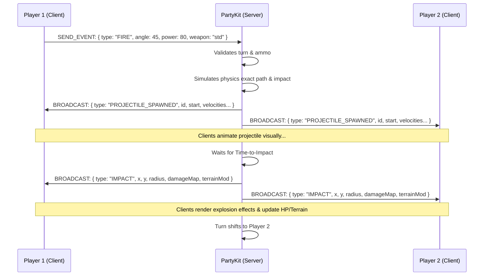

# Pocket Artillery: Multiplayer Architecture & Migration Plan

This document details the production-ready architecture for upgrading the existing Quasar + Phaser 3 game into a fully scalable multiplayer experience using PartyKit and Supabase.

---

## 1. Overall Architecture

The architecture shifts from a purely client-side simulation to a **Server-Authoritative Room-Based** model using PartyKit.

*   **Frontend (Quasar + Phaser 3 + Pinia)**: 
    *   **Quasar**: Manages the application shell, UI, routing, and mobile packaging (Capacitor).
    *   **Phaser**: Acts as the rendering engine and client-side interpolator. It simulates local player movement instantly for responsiveness (client prediction), but defers authoritative results (damage, terrain destruction) to the server.
    *   **Pinia**: Stores the application-level state (user profiles, active room details, matchmaking status).
*   **Backend (PartyKit)**:
    *   Provides the WebSocket connection.
    *   Acts as the authoritative game server evaluating mechanics (turns, firing, physics collisions).
    *   Manages rooms/lobbies.
*   **Database (Supabase)**:
    *   PostgreSQL for persistent data.
    *   Stores `users`, `rooms` (historical), `matches`, `replays`.

---

## 2. Server-Authoritative Design

### What Remains Client-Side:
*   Visual UI transitions and local menus.
*   Local aiming previews (trajectory lines).
*   Audio playback.
*   Particle rendering (visual only).
*   Client-side prediction for local aiming angles.

### What Moves to Server-Side (PartyKit):
*   Turn management (whose turn is it in the match).
*   Projectile physics simulation (to guarantee deterministic hits for all clients).
*   Collision detection (Projectile vs Terrain, Projectile vs Tank).
*   Weapon inventory consumption.
*   Health management and damage calculation.
*   Terrain modification triggers.

### Shared Deterministic Logic:
*   Instead of duplicating physics engines, PartyKit runs a lightweight headless physics loop or a point-mass calculation for projectiles. Because artillery arcs are mathematically deterministic ($v_xt, v_yt - \frac{1}{2}gt^2$), the server calculates the exact trajectory and collision points, then sends the collision timestamp/location to clients. Clients visually animate the projectile along that exact arc.

---

## 3. Room Management

PartyKit scales naturally by isolating connections into "Rooms". Each Room is spawned on-demand.

*   **Create Room**: Client requests a room (`POST /rooms`). Supabase stores the room ID. Client connects to `wss://game.partykit.dev/parties/match/<ROOM_ID>`.
*   **Join Room/Matchmaking**: Client fetches an available room code from Supabase, or joins via a friend's code. Connects to the PartyKit socket for that room.
*   **Leave/Destroy Room**: Managed through WebSocket `onClose`. PartyKit automatically hibernates empty rooms.

---

## 4. Match Lifecycle

1.  **Waiting**: Room created, waiting for Player 2.
2.  **Starting**: Both players connected. Server calculates initial terrain map, assigns tank positions, determines Player 1's turn, and sends `MATCH_START` sync payload.
3.  **Playing**: Loop of Turn Start -> Aiming -> Fire -> Projectile Animates -> Collision -> Turn Resolve.
4.  **Reconnecting**: If a player drops, connection state is marked "DISCONNECTED". The match enters a paused state for 60 seconds before forfeit.
5.  **Finished**: HP drops to 0. Server broadcasts `MATCH_END` and flushes results to Supabase.

---

## 5. State Management

*   **PartyKit Server State (The Source of Truth)**
    ```typescript
    export interface RoomState {
      id: string;
      status: 'waiting' | 'starting' | 'playing' | 'paused' | 'finished';
      players: PlayerState[];
      activePlayerIndex: number;
      terrain: number[]; // e.g., Array of heights matching width
      wind: number;
    }
    ```

---

## 6. Synchronization Strategy

*   **Terrain**: Generated using a seeded random algorithm on the server. The server sends the seed or the compacted heightmap array once upon match start.
*   **Projectile Launches**: Client sends `{ type: 'FIRE', angle: 45, power: 80, weaponId: 'nuke' }`. The server validates it is their turn, deducts ammo, calculates the exact impact `x, y` and time-to-impact (TTI). The server broadcasts `{ type: 'PROJECTILE_FIRED', startX, startY, velocityX, velocityY, impactX, impactY, tti }`. 
*   **Explosions/Damage/Terrain Mod**: Sent globally by the server strictly *after* the TTI has elapsed.
    `{ type: 'EXPLOSION', x, y, radius, damage, affectedPlayers: [{ id, newHp }] }`.

---

## 7. Event Flow Diagrams

### Fire Weapon Flow



---

## 8. Anti-Cheat Design

*   **Fake Firing / Turn Manipulation**: The server explicitly checks `state.activePlayerId === sender.id` upon receiving any `FIRE` payload.
*   **Projectile Modification / Speed Hacks**: Clients do not dictate where the projectile lands. The client only sends `(angle, power)`. The server calculates where it lands, meaning a hacked client sending "Hit Player 2 for 999 damage" is ignored.
*   **Fake Health Updates**: Health is ONLY kept on the server and synced outward.

---

## 9. Replay System

*   **Event Sourcing**: PartyKit stores an ordered array of events locally in RAM/Storage during the match lifecycle.
*   Every `MATCH_START`, `PROJECTILE_SPAWNED`, and `IMPACT` is recorded with a tick/timestamp.
*   When the match ends, the complete event array is dumped into a Supabase JSONB column `replays`.
*   A client rebuilding the replay runs through the array and injects events into the Phaser game engine chronologically using timers.

---

## 10. Database Design (Supabase PostgreSQL)

```sql
-- Users (managed by Supabase Auth, extended profile)
CREATE TABLE users (
  id UUID REFERENCES auth.users(id) PRIMARY KEY,
  username TEXT UNIQUE NOT NULL,
  mmr INTEGER DEFAULT 1000,
  created_at TIMESTAMPTZ DEFAULT NOW()
);

-- Matches
CREATE TABLE matches (
  id UUID PRIMARY KEY DEFAULT uuid_generate_v4(),
  status TEXT NOT NULL, -- 'finished', 'aborted'
  winner_id UUID REFERENCES users(id),
  started_at TIMESTAMPTZ DEFAULT NOW(),
  ended_at TIMESTAMPTZ
);

-- Match Players Pivot
CREATE TABLE match_players (
  match_id UUID REFERENCES matches(id),
  user_id UUID REFERENCES users(id),
  team_index INTEGER,
  PRIMARY KEY (match_id, user_id)
);

-- Replays
CREATE TABLE replays (
  match_id UUID REFERENCES matches(id) PRIMARY KEY,
  event_log JSONB NOT NULL,
  created_at TIMESTAMPTZ DEFAULT NOW()
);

-- Indexes
CREATE INDEX idx_match_players_user ON match_players(user_id);
```

---

## 11. PartyKit Backend Structure

**Directory Structure:**
```text
backend/
├── src/
│   ├── index.ts               # PartyServer implementation
│   ├── types.ts               # Shared contracts
│   ├── handlers/
│   │   ├── MatchHandler.ts    # Central match logic
│   │   ├── PhysicsEngine.ts   # Headless artillery arc calculations
│   │   └── ReplaySaver.ts     # Supabase flush logic
└── package.json
```

**Implementation Example:**
```typescript
// backend/src/index.ts
import type { Party, PartyServer, Connection } from "partykit/server";
import { MatchHandler } from "./handlers/MatchHandler";

export default class GameRoom implements PartyServer {
  private match: MatchHandler;

  constructor(readonly party: Party) {
    this.match = new MatchHandler(party);
  }

  onConnect(conn: Connection, ctx: Party.ConnectionContext) {
    this.match.handleJoin(conn);
  }

  onMessage(message: string, sender: Connection) {
    const event = JSON.parse(message);
    this.match.processEvent(event, sender);
  }
}
```

---

## 12. Frontend Structure (Quasar + Pinia + Phaser)

**Directory Structure:**
```text
src/
├── boot/
│   └── partykit.ts            # Boot wrapper instantiating PartySocket
├── composables/
│   └── useMultiplayer.ts      # Vue hooks for game state
├── stores/
│   ├── useMultiplayerStore.ts # Pinia store for network events & lobby
│   └── useGameStore.ts        # Pinia store for active game stats (HP, Names)
├── game/
│   ├── GameEventBus.ts        # Bridges Phaser & Vue/PartyKit
│   ├── scenes/
│   │   ├── MainMenu.ts
│   │   └── BattleScene.ts     # Subscribes to GameEventBus
│   └── systems/               # Handlers strictly for rendering
```

---

## 13. Pinia Stores

```typescript
// src/stores/useMultiplayerStore.ts
import { defineStore } from 'pinia';
import PartySocket from 'partysocket';
import { ref } from 'vue';

export const useMultiplayerStore = defineStore('multiplayer', () => {
    const socket = ref<PartySocket | null>(null);
    const roomState = ref<any>(null);

    function connect(roomId: string) {
        socket.value = new PartySocket({
            host: import.meta.env.VITE_PARTYKIT_HOST,
            room: roomId
        });
        
        socket.value.addEventListener('message', (e) => {
            const data = JSON.parse(e.data);
            if (data.type === 'SYNC_STATE') {
                roomState.value = data.state;
            }
        });
    }

    function sendEvent(eventPayload: any) {
        socket.value?.send(JSON.stringify(eventPayload));
    }

    return { socket, roomState, connect, sendEvent };
});
```

---

## 14. Multiplayer Service Layer / Event Bridging

Because Phaser runs its own internal loop and Vue/Pinia runs separately, we need an Event Bus.

1. Pinia receives a WebSocket frame: `{ type: 'PROJECTILE_SPAWNED', ... }`
2. Pinia emits a global JS event: `EventBus.emit('network-projectile-fired', payload)`
3. Phaser `BattleScene` picks it up: 
   ```typescript
   EventBus.on('network-projectile-fired', (payload) => {
       this.spawnNetworkProjectile(payload); // Visually animates without updating physics logic
   });
   ```

---

## 15. TypeScript Contracts

```typescript
// Shared between Backend and Frontend
export interface ClientFireEvent {
  type: 'FIRE_WEAPON';
  angle: number;       // 0-180
  power: number;       // 0-100
  weaponId: string;
}

export interface ServerProjectileEvent {
  type: 'SERVER_PROJECTILE_SPAWNED';
  x: number;
  y: number;
  vx: number;
  vy: number;
  weaponId: string;
  tti: number; // Time to impact in ms
}

export interface ServerImpactEvent {
  type: 'SERVER_IMPACT';
  x: number;
  y: number;
  radius: number;
  damageMap: Record<string, number>; // playerId => damage amount
  terrainSeed?: number; // Optional verification
}
```

---

## 16. Phaser Integration Example

**Current (Local Simulation):**
```typescript
class WeaponSystem {
  fire(angle: number, power: number) {
      // Calculates trajectories locally and immediately spans
      this.spawnProjectile(angle, power);
  }
}
```

**Migrated (Multiplayer Target):**
```typescript
class WeaponSystem {
  // Triggered by UI Button
  requestFire(angle: number, power: number, weaponId: string) {
     multiplayerStore.sendEvent({
        type: 'FIRE_WEAPON',
        angle,
        power, weaponId
     });
  }
  
  // Triggered by Server Event Bus
  onNetworkFire(event: ServerProjectileEvent) {
     // Purely visual representation. Disables collision checking locally.
     const proj = new NetworkProjectile(this.scene, event.x, event.y, event.vx, event.vy);
     // Let Phaser handle the visual tween matching the parameters
  }
  
  // Triggered by Server Event Bus
  onNetworkImpact(event: ServerImpactEvent) {
     this.explosionSystem.playEffect(event.x, event.y);
     this.terrainSystem.carve(event.x, event.y, event.radius);
     this.healthSystem.applyDamageMap(event.damageMap);
  }
}
```

---

## 17. Migration Plan

*   **Phase 1: PartyKit Setup**: Create backend repository. Deploy a basic "Echo" room allowing two clients to connect. *(Complexity: Low)*
*   **Phase 2: Types & Bus Abstraction**: Introduce the GameEventBus into the Quasar app. Decouple Phaser input listeners so they call Pinia Actions instead of direct Phaser actions. *(Complexity: Medium)*
*   **Phase 3: Turn Synchronization**: Move turn logic to backend. Server emits `TURN_START`. UI binds weapon controls to `isMyTurn` directly derived from network state rather than local boolean. *(Complexity: Low)*
*   **Phase 4: Headless Physics (The Hardest Step)**: Recreate the artillery trajectory arc math accurately on the NodeJS PartyKit server to match Phaser's exact gravity scale/values. *(Complexity: High)*
*   **Phase 5: Terrain Generation Sync**: Generate the initial terrain arrays on the server. On match start, clients render the array. *(Complexity: Medium)*
*   **Phase 6: Result Application**: Bridge server `SERVER_IMPACT` events with Phaser visual emitters. Disconnect local collision logic. *(Complexity: Medium)*
*   **Phase 7: Supabase Integration & Auth**: Players must log in. Match results write to Supabase. *(Complexity: Low)*
*   **Phase 8: Matchmaking**: Add a lobbying system searching for empty rooms or creating them dynamically. *(Complexity: Moderate)*
