<div align="center">



<h1>🎯 Pocket Artillery</h1>

<p><em>A modern, premium-quality multiplayer artillery battle game — inspired by the classic tank duels of old, rebuilt for the web.</em></p>

<p>
  
  
  
  
  
</p>

<p>
  <a href="#-how-to-play">Play</a> &nbsp;•&nbsp;
  <a href="#-arsenal">Arsenal</a> &nbsp;•&nbsp;
  <a href="#-run-locally">Run Locally</a> &nbsp;•&nbsp;
  <a href="#-architecture">Architecture</a>
</p>

</div>

---

## ⚔️ The Battle

Two tanks. One shifting battlefield. Dial in your **angle** and **power**, read the **wind**, and lob a shell across procedurally-generated, fully **destructible terrain**. Miss and you carve a crater. Hit and you rewrite the landscape — and your opponent's health bar.

**Alpha** `#22d3ee` faces off against **Omega** `#fb7185` in fast, turn-based duels where every shot is validated server-side, so nobody can fudge a trajectory.

```
        ●
     ╱     ╲          ← your arc, bent by the wind
   ╱          ╲
 ▟▛            ╲   💥
▔▔▔▔▔╲___      ▟▛▔▔▔
          ╲___╱      ← terrain you just reshaped
```

---

## 🎮 How to Play

| Step | Action |
| :--: | :----- |
| **1** | Pick your **callsign** and create a room — or drop a friend's **room code** to join. |
| **2** | On your turn, adjust **Angle** (0–180°) and **Power** (0–100). |
| **3** | Check the **wind** — it nudges your shell mid-flight. |
| **4** | Choose a weapon from your **arsenal** and **FIRE**. |
| **5** | Reduce your opponent from **100 HP** to zero. Last tank standing wins. 🏆 |

---

## 💣 Arsenal

| Weapon | Icon | Blast Radius | Damage | Behavior |
| :----- | :--: | :----------: | :----: | :------- |
| **Standard** | 🎯 | 60 | 25 | The reliable workhorse round. Clean, predictable arcs. |
| **Cluster** | 💥 | 45 | 15 | Splits on impact into a spread of secondary bomblets for wide coverage. |
| **Mini Nuke** | ☠️ | 130 | 55 | Devastating. Massive crater, huge damage, and a signature smoke plume. |

---

## ✨ Features

- 🌍 **Destructible terrain** — every explosion permanently reshapes the battlefield, and tanks fall when the ground beneath them is blown away.
- 🌬️ **Wind physics** — deterministic ballistic arcs (`vₓt`, `vᵧt − ½gt²`) with per-round wind drift.
- 🎇 **Juicy particle effects** — sparks, debris, and nuke smoke trails rendered in real time.
- 🌐 **Server-authoritative multiplayer** — turns, physics, and damage are all resolved on the backend for cheat-proof matches.
- 🔁 **Reconnect grace window** — drop your connection and rejoin within **60 seconds** without forfeiting.
- 📱 **Responsive UI** — a premium dark, neon-accented interface built with Tailwind and Framer Motion.

---

## 🚀 Run Locally

**Prerequisites:** Node.js **20+** (the game uses Next.js 15 / React 19).

### 1. Frontend

```bash
# install dependencies
npm install

# add your Gemini API key
cp .env.example .env.local   # then edit GEMINI_API_KEY

# launch the dev server
npm run dev
```

Open **http://localhost:3001** to enter the war room.

> ⚠️ The app runs on **:3001** because SpacetimeDB's local server uses **:3000** — they'd otherwise collide. `npm run dev` sets this for you.

### 2. Backend (multiplayer)

The real-time layer runs on **SpacetimeDB** — a single Rust/WASM module
(`stdb-module/`) that holds all game state and runs the authoritative physics.
In a second terminal:

```bash
spacetime start                                              # local instance on :3000
spacetime publish -p stdb-module --server local pocket-artillery
npm run stdb:generate                                        # generate TS client bindings
```

Then point the frontend at it via `.env.local`:

```bash
NEXT_PUBLIC_SPACETIMEDB_URI="ws://localhost:3000"
NEXT_PUBLIC_SPACETIMEDB_MODULE="pocket-artillery"
```

> 💡 Single-player / local skirmish works without the backend — spin up SpacetimeDB only when you want live multiplayer matches.

📄 Full setup + production deploy (Maincloud + Vercel): [`SPACETIMEDB_DEPLOY.md`](./SPACETIMEDB_DEPLOY.md)

---

## 🏗️ Architecture

Pocket Artillery uses a **server-authoritative, room-based** model — the client renders and predicts, the server decides.

```
┌────────────────┐    WebSocket (subscribe + reducers)   ┌──────────────────────┐
│    Frontend    │ ◀───────────────────────────────────▶ │     SpacetimeDB      │
│ Next.js/React  │        table sync (auto)              │   Rust/WASM module   │
│  canvas engine │        reducer calls (fire/aim)       │ tables + reducers +  │
│ client predict │                                       │ authoritative physics│
└────────────────┘                                       └──────────────────────┘
```

| Layer | Responsibility |
| :---- | :------------- |
| **Frontend** | Rendering, local aiming previews, client-side prediction, audio & particles. |
| **SpacetimeDB** | One WASM module = realtime backend **and** database: turn management, deterministic projectile physics, collision, damage, terrain, and persistent match/replay state — all in tables + reducers. |

📄 SpacetimeDB + Vercel deployment: [`SPACETIMEDB_DEPLOY.md`](./SPACETIMEDB_DEPLOY.md) · Original design notes: [`MULTIPLAYER_ARCHITECTURE.md`](./MULTIPLAYER_ARCHITECTURE.md)

---

## 🧰 Tech Stack

**Next.js 15** · **React 19** · **Tailwind CSS 4** · **Framer Motion** · **lucide-react** · **SpacetimeDB** (Rust/WASM) · **Google Gemini API**

---

<div align="center">
<sub>Load your shot. Read the wind. <strong>Fire.</strong> 🎯💥</sub>
</div>
